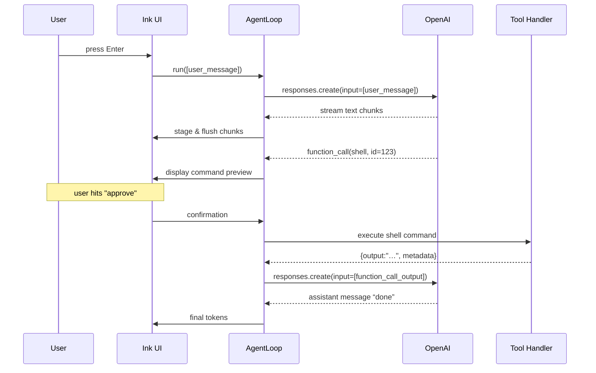

# Agent Loop Deep‑Dive

This document explains – **in detail** – how the _agent loop_ inside Codex CLI
works. Think of it as a “FROM prompt **TO** side‑effect” reference: we will
walk through every layer that a user instruction touches until the model has
finished thinking, shell commands have run, patches landed, and final tokens
have streamed back to the terminal.

> **Source‑of‑truth**: [`src/utils/agent/agent-loop.ts`](../codex-cli/src/utils/agent/agent-loop.ts).  
> The file is ~1 400 lines and heavily commented – use it side‑by‑side with
> this narrative.

---

## 1. Bird’s‑eye overview

```text
┌──────────────────────────────────────┐
│  Ink / React terminal UI (chat)      │
└──────────────────────────────────────┘
               │  user input / streamed output
               ▼
┌──────────────────────────────────────┐
│  AgentLoop.run()                     │
│  – builds request                    │
│  – streams OpenAI events             │
│  – routes tool calls                 │
└──────────────────────────────────────┘
      │             ▲
      │ tool output │ staged messages
      ▼             │
┌───────────────────┴──────────────────┐
│  Tool Handlers (utils/agent/*)       │
│   • handle‑exec‑command.ts           │
│   • apply‑patch.ts                   │
│   • sandbox/*                        │
└──────────────────────────────────────┘
```

The `AgentLoop` sits between **UI** and **OpenAI**. It is responsible for:

- constructing requests (`input`, `instructions`, `previous_response_id`, …),
- keeping a streaming HTTP/2 connection open to receive `response.*` events,
- forwarding textual output to the UI _immediately_,
- **detecting** and **executing** `function_call` items emitted by the model,
- turning the execution result into `function_call_output` items and feeding
  them back to the model (→ inner‑loop),
- applying user‑set **approval policies**,
- robust cancellation & retry logic so a flaky network does not crash the CLI.

---

## 2. Core data structures

Codex uses the **OpenAI “Responses” API** (a superset of Chat Completions).
Two type aliases matter when reading the code:

| Type                                  | Purpose                                          |
| ------------------------------------- | ------------------------------------------------ |
| `ResponseInputItem`                   | Items _sent **to**_ the model (`user_message`,   |
|                                       | `function_call_output`, …).                      |
| `ResponseItem` _(a subset of Output)_ | Items _coming **from**_ the model during a turn. |

Within `ResponseInputItem` the most important variants are:

- `user_message` – the user’s natural‑language instruction(s).
- `function_call_output` – JSON result that answers a previous tool call.

And in `ResponseItem` we care about:

- `text` – normal assistant message tokens.
- `function_call` – the model is instructing Codex to invoke a tool.

`AgentLoop` treats both in a symmetrical fashion: every _output_ item may
generate additional _input_ items for the **next** request, creating a loop.

---

## 3. Lifecycle of `AgentLoop.run()`

`run()` is called once per **user turn** (i.e. whenever the user presses
<kbd>Enter</kbd>). Pseudocode for the high‑level flow:

```ts
async function run(input: ResponseInputItem[], lastId = "") {
  resetCancellationFlags();

  // 1. Pre‑pend synthetic aborts if the previous turn was cancelled.
  turnInput = [...abortedFunctionOutputs, ...input];

  while (turnInput.length > 0) {
    stream = await oai.responses.create({
      model,
      instructions,
      previous_response_id: lastId,
      input: turnInput,
      stream: true,
      tools: [shellSpec],
    });

    for await (event of stream) {
      if (event.type === "response.output_item.done") stage(event.item);
      if (event.type === "response.completed") {
        lastId = event.response.id;
        turnInput = await processEvents(event.response.output);
      }
    }
  }
  flushStagedItemsToUI();
}
```

The interesting pieces annotated:

### 3.1 Turn input initialisation

_If_ the user cancelled the previous turn whilst a tool call was outstanding
OpenAI now expects a matching `function_call_output` in the next request, else
it errors with **“No tool output found for function call …”**. To fulfil that
contract Codex stores the call IDs in `pendingAborts` and synthesises

```json
{ "type": "function_call_output", "call_id": "…", "output": "aborted" }
```

items on the next invocation.

### 3.2 Streaming & staging

`AgentLoop` does **not** immediately render every chunk. Instead it **stages**
them in an array and uses `setTimeout(10)` to batch‑deliver. This yields two
benefits:

1. The UI still feels live (10 ms is imperceptible).
2. If the user presses ESC within that 10 ms window the generation counter
   invalidates the batch so nothing accidentally leaks from a cancelled run.

### 3.3 Handling `function_call`

When `processEventsWithoutStreaming()` encounters a `function_call` it
delegates to `handleFunctionCall()` which:

1. Normalises the item (chat vs. responses API shape differences).
2. Parses the JSON‑encoded `arguments` string.
3. Looks up a handler by `name` – currently `shell` (alias `container.exec`).
4. Runs the handler **inside an approval guard**.
5. Collects `[function_call_output, …additionalInput]` items to be queued for
   the next loop iteration.

Handlers receive an **`AbortSignal`** (derived from the per‑run
`execAbortController`) so they can terminate gracefully when the user cancels.

### 3.4 Loop continuation

If executing tool calls produced further `ResponseInputItem`s (`turnInput` is
non‑empty) the `while` loop issues _another_ OpenAI request – _but_ with
`previous_response_id` set, so the model continues the same conversation
instead of starting a new one.

### 3.5 Flush

Only after all nested tool call chains have settled – i.e. `turnInput` is
empty – does `AgentLoop` flush the remaining staged items, clear
`pendingAborts`, and emit a final `onLoading(false)` to the UI.

---

## 4. Concurrency, cancellation & generations

Running shell commands while a streaming request is open means _two_ async
operations happen in parallel. Codex defends against race conditions using:

1. **`thisGeneration` counter** – incremented on every `run()` _and_ every
   `cancel()`. Any event carrying a stale generation is ignored.
2. **`currentStream` reference** – stored so `cancel()` can `controller.abort()`
   the HTTP/2 connection immediately.
3. **Per‑run `execAbortController`** – passed into tool handlers so inflight
   processes (`child_process.spawn`, etc.) are killed when the user cancels.

The nuance: `cancel()` does **not** wipe `lastResponseId` _if_ there were
pending tool calls – otherwise the follow‑up request could not satisfy the
OpenAI contract (see §3.1).

---

## 5. Approval policies

Before executing a command or applying a patch Codex asks `approvals.ts` whether
the action should be:

- **Auto‑approved** (e.g. `git status` is deemed safe),
- **Require quick diff review** (user presses <kbd>y</kbd>/<kbd>n</kbd>),
- **Require full manual intervention** (opens external `$EDITOR`),
- **Rejected outright**.

The handler calls back into `AgentLoop.getCommandConfirmation()` which surfaces
a modal overlay in the Ink UI when necessary. The returned
`CommandConfirmation.review` value dictates whether execution proceeds.

---

## 6. Error handling & retries

The outer `try … catch` around `run()` purposely absorbs _transient_ issues and
turns them into system messages rather than crashing:

- **Network glitches** → detects `ERR_STREAM_PREMATURE_CLOSE`, errno values
  like `ECONNRESET`, OpenAI `APIConnectionError` subclasses.
- **Rate limits** → exponential back‑off (env var configurable) up to 5
  attempts; after that an error message is displayed with request‑ID & status.
- **Server (5xx) errors** → similarly surfaced after retries.
- **Client (4xx) errors** → usually configuration mistakes; surfaced once.

Timeouts are treated as retry‑able via `APIConnectionTimeoutError`.

---

## 7. Telemetry hooks

`thinkingStart` / `thinkingEnd` timestamps are captured so future versions can
publish _per turn_ and _cumulative_ thinking time. Emitting the numbers is
currently commented out but the plumbing is ready.

---

## 8. Extending the loop

Adding a new tool is straightforward:

1. Implement `utils/agent/<your‑tool>.ts` exporting a handler signature similar
   to `handle‑exec‑command`.
2. Teach `handleFunctionCall()` to route `name === "your_tool"` to the new
   file.
3. Append the JSON schema to the `tools` array passed to
   `oai.responses.create()` so the model can invoke it.

Because approval plumbing, cancellation propagation and streaming are handled
centrally you rarely need to touch `AgentLoop` itself.

---

## 9. Sequence diagram (happy path)



---

## 10. Key take‑aways

- **Single authoritative loop** – all retries, cancellation semantics, and
  approval logic live in one class.
- **Streaming‑first design** – UI sees results as soon as they are available;
  heavy work happens in the background handlers.
- **Robust contract with OpenAI** – never leaves a function_call hanging.
- **Minimal side‑effects without approval** – sandbox, diff preview, policy
  enforcement guarantee safety.

Happy hacking! If something in this document is unclear or outdated please
open an issue or PR – docs are code too.
